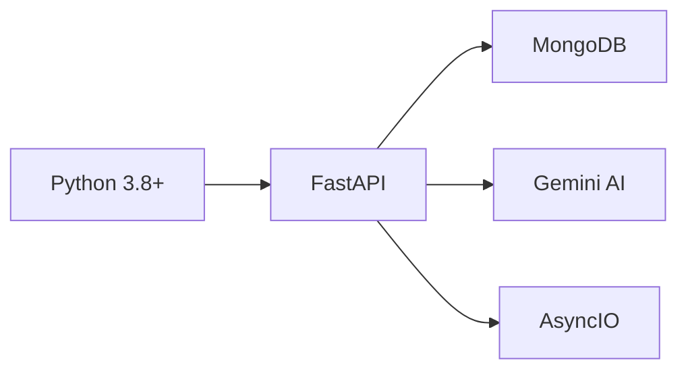
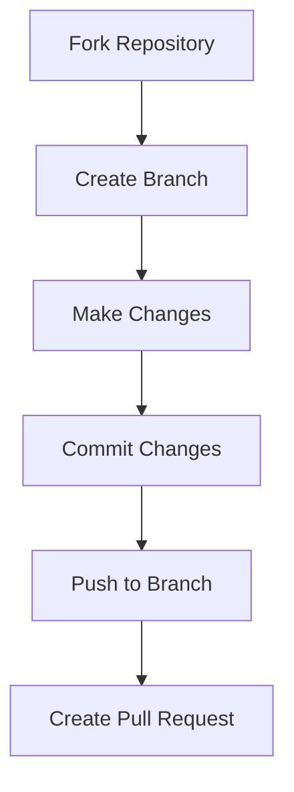

<div style="display: flex; align-items: center; justify-content: center; padding: 20px; background-color: #1e1e2f; color: white; height: 150px;">
    <h2>🎉 Selected for Social Winter of Code 2025! 🎉</h2>
</div>


# SocioSell: Social Media to Product Listing Generator 🛍️

[](https://www.python.org/)
[](https://fastapi.tiangolo.com/)
[](https://www.mongodb.com/atlas)
[](https://cloud.google.com/ai-platform)
[](https://tailwindcss.com/)
[](LICENSE)
[](CONTRIBUTING.md)
[](https://swoc.tech)
[](https://github.com/Varsha-1605/SocioSell/graphs/contributors)

<p align="center">
  An open-source initiative to transform social media content into comprehensive Amazon-style product listings using cutting-edge AI technology. </p>

[🌟 Features](#-features) •
[⚙️ Installation](#️-installation) •
[🚀 Usage](#-usage) •
[💡 API Endpoints](#-api-endpoints) •
[🤝 Contributing](#-contributing) •
[👥 Community](#-community)


</div>

---

## 🎯 Project Vision

SocioSell aims to bridge the gap between social media content and e-commerce by providing an open-source solution for automated product listing generation. Whether you're a developer, marketer, or e-commerce enthusiast, your contributions can help shape the future of social commerce.

## 📺 Project Demo

Watch our community demo:

[🎥 Watch Demo](https://github.com/Varsha-1605/SocioSell/blob/main/static/folder/Untitled%20video%20-%20Made%20with%20Clipchamp.mp4)

---

## 🌟 Features

<table>
  <tr>
    <td>
      <h3>🤖 AI-Powered Analysis</h3>
      <ul>
        <li>Google Generative AI integration</li>
        <li>Smart product detection</li>
        <li>Automatic feature extraction</li>
      </ul>
    </td>
    <td>
      <h3>🔄 Smart Processing</h3>
      <ul>
        <li>Real-time processing</li>
        <li>Async operations</li>
        <li>Intelligent matching</li>
      </ul>
    </td>
  </tr>
  <tr>
    <td>
      <h3>🎯 Product Categories</h3>
      <ul>
        <li>Electronics</li>
        <li>Fashion</li>
        <li>Home Decor</li>
        <li>Beauty</li>
        <li>Sports Equipment</li>
      </ul>
    </td>
    <td>
      <h3>💫 User Experience</h3>
      <ul>
        <li>Modern UI/UX</li>
        <li>Drag-and-drop uploads</li>
        <li>Interactive comparisons</li>
      </ul>
    </td>
  </tr>
</table>

## ⚠️ Current Implementation Status and Limitations

### Processing Limitations
- The system currently processes custom data that is not linked to the database
- Uses `image_data` and `video_data` for accessing media details
- Maximum processing capacity (due to Gemini API constraints):
  - Images: Maximum 5 images per request
  - Videos: Maximum 3 videos, each limited to 10 seconds

### Implementation Notes for Contributors
- `image_processor.py` and `video_processor.py` are implemented and functional
- Integration needed: These processors need to be linked to `main.py`
- Database integration is pending and is a key area for contribution

### Priority Areas for Contribution
1. Database Integration
   - Implement MongoDB connection for media storage
   - Create data models for products and listings
   - Add database querying functionality

2. Processor Integration
   - Link `image_processor.py` and `video_processor.py` to `main.py`
   - Implement error handling for processing failures
   - Add input validation for media files

3. UI/UX Improvements
   - Add progress indicators for processing
   - Implement drag-and-drop file upload
   - Create responsive design for mobile users

## 🛣️ Project Roadmap

### Phase 1 (Current)
- ✅ Basic image and video processing
- ✅ Initial API setup
- 🔄 Database integration

### Phase 2 (Upcoming)
- 📋 Enhanced error handling
- 📋 User authentication
- 📋 Batch processing capabilities

### Phase 3 (Future)
- 📋 Advanced AI features
- 📋 Social media platform integration
- 📋 Analytics dashboard


## 🔧 Technology Stack

### Backend Infrastructure


### Frontend Technologies


## ⚙️ Development Setup

```bash
# Clone repository
git clone https://github.com/Varsha-1605/SocioSell.git
cd SocioSell

# Set up virtual environment
python -m venv venv
source venv/bin/activate  # Windows: venv\Scripts\activate

# Install dependencies
pip install -r requirements.txt

# Create .env file
cat > .env << EOL
GOOGLE_API_KEY=your_google_api_key
MONGODB_URL=your_mongodb_connection_string
EOL

# Initialize database
python database_setup.py
```

### Troubleshooting Common Issues

1. Gemini API Connection
```bash
Error: Failed to connect to Gemini API
Solution: Ensure GOOGLE_API_KEY is properly set in .env file
```

2. MongoDB Connection
```bash
Error: MongoDB connection failed
Solution: Check MONGODB_URL format and network connectivity
```

3. Image Processing
```bash
Error: Image processing failed
Solution: Verify image format (supported: jpg, png) and size (<5MB)
```


## 📁 Project Structure
```
SocioSell/
├── 📜 main.py                    # FastAPI application entry point
├── 📁 .github/                   # GitHub specific files
│   └── ISSUE_TEMPLATE/          # Issue templates for contributions
├── 📁 static/                    # Static assets and files
├── 📁 templates/                 # HTML templates
├── 🔧 content_processor.py       # Content analysis and processing
├── 💾 database_setup.py          # Database initialization
├── 🖼️ image_processor.py         # Image processing module
├── 📊 image_data.py              # Image data structures
├── 🎥 video_processor.py         # Video processing module
├── 📊 video_data.py              # Video data structures
├── 🧪 test_image_processor.py    # Image processing tests
├── 🧪 test_video_processor.py    # Video processing tests
├── 📋 requirements.txt           # Project dependencies
├── 📝 README.md                  # Project documentation
├── 🔒 .env                       # Environment variables
└── 📝 .gitignore                # Git ignore rules
```
## 🚀 Usage

1. Start the development server:
```bash
uvicorn main:app --reload
```

2. Access the application at `http://localhost:8000`

## 💡 API Endpoints

<table>
  <tr>
    <th>Endpoint</th>
    <th>Method</th>
    <th>Description</th>
  </tr>
  <tr>
    <td><code>/upload/</code></td>
    <td>POST</td>
    <td>Upload & analyze products</td>
  </tr>
  <tr>
    <td><code>/search/{title}</code></td>
    <td>GET</td>
    <td>Search product database</td>
  </tr>
  <tr>
    <td><code>/listings/{product_id}</code></td>
    <td>GET</td>
    <td>Get listing details</td>
  </tr>
  <tr>
    <td><code>/compare/{product_id}</code></td>
    <td>GET</td>
    <td>Compare products</td>
  </tr>
  <tr>
    <td><code>/health</code></td>
    <td>GET</td>
    <td>Check health status of DB</td>
  </tr>
</table>

## 🤝 Contributing

We warmly welcome contributions from developers of all skill levels! Here's how you can help:



### Detailed Contribution Guide
## Star this repository ⭐
#### 1. Environment Setup
```bash
# Fork and clone
git fork https://github.com/Varsha-1605/SocioSell
git clone [your-fork-url]
cd SocioSell

# Setup virtual environment
python -m venv venv
source venv/bin/activate  # Windows: venv\Scripts\activate
pip install -r requirements.txt

# Configure environment variables
cp .env.example .env
# Edit .env with your API keys
```

#### 2. Development Workflow
1. Find or create an issue
2. Comment for assignment
3. Create feature branch:
```bash
git checkout -b feature/your-feature-name
```

#### 3. Code Guidelines
- Follow PEP 8
- Add docstrings
- Write unit tests
- Handle exceptions properly
- Use type hints

#### 4. Submitting Changes
```bash
# Test your changes
python -m pytest

# Commit and push
git add .
git commit -m "feat: description"
git push origin feature/your-feature-name
```

#### 5. Pull Request Process
1. Create PR from feature branch
2. Fill PR template
3. Link related issue
4. Await review

### 🎯 Good First Issues
- Look for issues tagged with `good-first-issue`
- Join our [community discussions](https://github.com/Varsha-1605/SocioSell/discussions) for guidance

## 👥 Community

- 💬 Join our [Discord Server](https://discord.gg/n34tSJ3TBs)
- 🔗 Connect on [LinkedIn](www.linkedin.com/in/varsha-dewangan-197983256)
- 🐦 Follow us on [Twitter]( https://x.com/varsha_dew454)
- 📧 Contact maintainers: varshadewangan1605@gmail.com

### 🌟 Contributors

Thanks to these wonderful people:

<a href="https://github.com/Varsha-1605/SocioSell/graphs/contributors">
  
</a>

## 📄 License

This project is licensed under the MIT License - see the [LICENSE](LICENSE) file for details.

## 🙏 Acknowledgments

- All our amazing contributors
- [Social Winter of Code](https://swoc.tech) for selecting our project
- [Google Generative AI](https://cloud.google.com/ai-platform)
- [MongoDB Atlas](https://www.mongodb.com/atlas)
- [TailwindCSS](https://tailwindcss.com/)
- [FastAPI](https://fastapi.tiangolo.com/)

---

<div align="center">

Made with ❤️ by the SocioSell Community

[⬆ Back to Top](#socialsell-social-media-to-product-listing-generator-)

</div>
