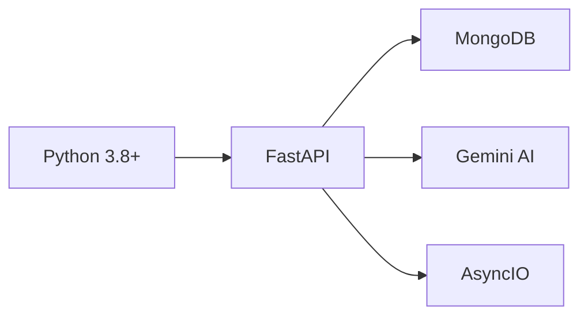
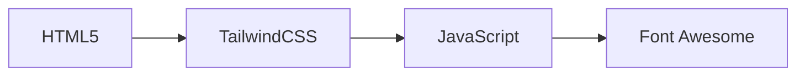
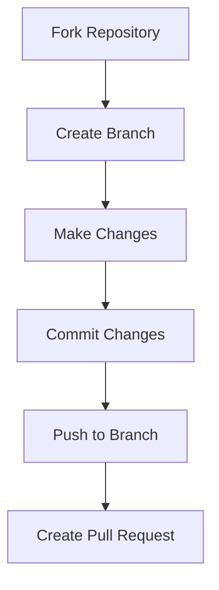

<div align="center">
  

# Social Media to Product Listing Generator 🛍️

[](https://www.python.org/)
[](https://fastapi.tiangolo.com/)
[](https://www.mongodb.com/atlas)
[](https://cloud.google.com/ai-platform)
[](https://tailwindcss.com/)
[](LICENSE)

<p align="center">
  Transform social media content into comprehensive Amazon-style product listings using cutting-edge AI technology
</p>

[🌟 Features](#-features) •
[⚙️ Installation](#️-installation) •
[🚀 Usage](#-usage) •
[💡 API Endpoints](#-api-endpoints) •
[🤝 Contributing](#-contributing) •
[📧 Support & Contact](#-support--contact)

</div>

---
🎮 Demo
<div align="center">
A
</div>

---

## 🌟 Features

<table>
  <tr>
    <td>
      <h3>🤖 AI-Powered Analysis</h3>
      <ul>
        <li>Google Generative AI integration</li>
        <li>Smart product detection</li>
        <li>Automatic feature extraction</li>
      </ul>
    </td>
    <td>
      <h3>🔄 Smart Processing</h3>
      <ul>
        <li>Real-time processing</li>
        <li>Async operations</li>
        <li>Intelligent matching</li>
      </ul>
    </td>
  </tr>
  <tr>
    <td>
      <h3>🎯 Product Categories</h3>
      <ul>
        <li>Electronics</li>
        <li>Fashion</li>
        <li>Home Decor</li>
        <li>Beauty</li>
        <li>Sports Equipment</li>
      </ul>
    </td>
    <td>
      <h3>💫 User Experience</h3>
      <ul>
        <li>Modern UI/UX</li>
        <li>Drag-and-drop uploads</li>
        <li>Interactive comparisons</li>
      </ul>
    </td>
  </tr>
</table>

## 🔧 Technology Stack

### Backend Infrastructure


### Frontend Technologies


## ⚙️ Installation

```bash
# Clone repository
git clone https://github.com/yourusername/social-media-product-listing.git
cd social-media-product-listing

# Set up virtual environment
python -m venv venv
source venv/bin/activate  # Windows: venv\Scripts\activate

# Install dependencies
pip install -r requirements.txt

# Create .env file
cat > .env << EOL
GOOGLE_API_KEY=your_google_api_key
MONGODB_URL=your_mongodb_connection_string
EOL

# Initialize database
python database_setup.py
```

## 📁 Project Structure

```ascii
project/
├── 📜 main.py                # Entry point
├── 🖼️ image_processor.py     # AI image analysis
├── 🔄 content_processor.py   # Content processing
├── 💾 database_setup.py      # DB initialization
├── 📁 static/               # Static assets
│   ├── electronics/
│   ├── fashion/
│   ├── home_decor/
│   ├── beauty/
│   ├── sports/
│   └── styles.css
├── 📝 templates/            # HTML templates
│   └── index.html
├── 🔒 .env                 # Environment vars
└── 📋 requirements.txt     # Dependencies
```

## 🚀 Usage

1. Start the server:
```bash
uvicorn main:app --reload
# or
python main.py
```

2. Access the application:
   - Open browser: `http://localhost:8000`
   - Upload product images
   - Add titles and captions
   - Generate listings
   - Compare products

## 💡 API Endpoints

<table>
  <tr>
    <th>Endpoint</th>
    <th>Method</th>
    <th>Description</th>
  </tr>
  <tr>
    <td><code>/upload/</code></td>
    <td>POST</td>
    <td>Upload & analyze products</td>
  </tr>
  <tr>
    <td><code>/search/{title}</code></td>
    <td>GET</td>
    <td>Search product database</td>
  </tr>
  <tr>
    <td><code>/listings/{product_id}</code></td>
    <td>GET</td>
    <td>Get listing details</td>
  </tr>
  <tr>
    <td><code>/compare/{product_id}</code></td>
    <td>GET</td>
    <td>Compare products</td>
  </tr>
</table>

## ⚠️ Prerequisites

- Python 3.8+
- MongoDB Atlas account
- Google Cloud account with Generative AI API access
- Node.js & npm

## 🔒 Environment Variables

| Variable | Description |
|----------|-------------|
| `GOOGLE_API_KEY` | Google Cloud API key |
| `MONGODB_URL` | MongoDB connection string |

## 🤝 Contributing



## 📧 Support & Contact

<details>
<summary>Get Help</summary>

- 📧 Email: varshadewangan454@gmail.com
- 🐛 Issue Tracker: [GitHub Issues](https://github.com/yourusername/social-media-product-listing/issues)
- 💬 Discussion: [GitHub Discussions](https://github.com/yourusername/social-media-product-listing/discussions)
</details>

## 🙏 Acknowledgments

- [Google Generative AI](https://cloud.google.com/ai-platform) - AI capabilities
- [MongoDB Atlas](https://www.mongodb.com/atlas) - Database services
- [TailwindCSS](https://tailwindcss.com/) - UI framework
- [FastAPI](https://fastapi.tiangolo.com/) - Backend framework

## 📄 License

This project is licensed under the MIT License - see the [LICENSE](LICENSE) file for details.

---

<div align="center">

Made with ❤️ by [Varsha Dewangan](https://github.com/Varsha-1605)

[⬆ Back to Top](#social-media-to-product-listing-generator-)

</div>
